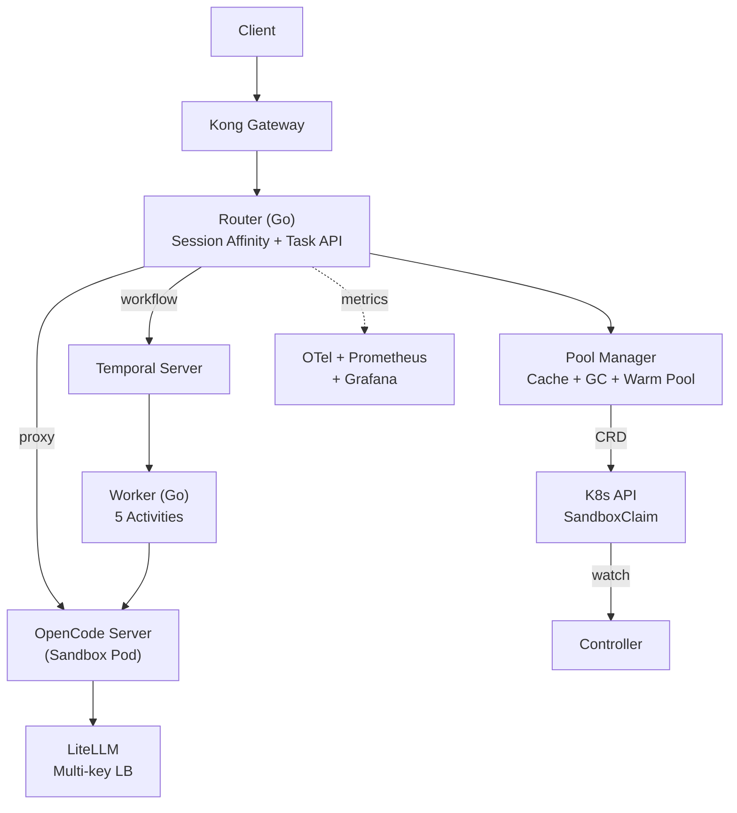

# opencode-scale

[English](README.md) | [中文](README.zh-CN.md)

Production-grade orchestration layer for [OpenCode Server](https://github.com/opencode-ai/opencode), scaling from hundreds to thousands of concurrent agent sessions.

## Architecture



## Components

| Component | Purpose |
|-----------|---------|
| **Router** | HTTP gateway with session affinity, reverse proxy, task API, SSE streaming |
| **Controller** | K8s controller managing SandboxClaim lifecycle and GC |
| **Worker** | Temporal worker executing 5-activity coding task workflows |
| **Pool Manager** | Sandbox pool with warm instances, GC loop, and auto-replenishment |

## Tech Stack

- **Go 1.25** — Core orchestration code
- **Kong 3.x** — API gateway (rate limiting, auth, observability)
- **Temporal 1.24+** — Workflow orchestration with retries and timeouts
- **Agent Sandbox** (kubernetes-sigs) — Isolated sandbox environments (gVisor)
- **LiteLLM** — Multi-provider LLM proxy with key rotation
- **OpenTelemetry + Prometheus + Grafana** — Full observability stack

## Quick Start

### Prerequisites

- Go 1.25+
- Docker

### Local Development (Docker Compose)

```bash
# Start all services (Temporal, mock-opencode, router, worker)
make compose-up

# Verify
curl -s http://localhost:8080/health | jq .

# Seed sample tasks
make seed

# View logs
make compose-logs

# Stop
make compose-down
```

### Build from Source

```bash
make deps     # Download dependencies
make build    # Build all 5 binaries
make test     # Run tests with race detection
```

### K8s Deployment

```bash
# Helm
helm install opencode-scale ./charts/opencode-scale \
  --namespace opencode-scale --create-namespace

# Kustomize
make deploy-dev   # Dev overlay
make deploy-prod  # Production overlay
```

## API Usage

```bash
# Submit a coding task
curl -X POST http://localhost:8080/api/v1/tasks \
  -H "Content-Type: application/json" \
  -H "X-API-Key: your-key" \
  -d '{
    "prompt": "Write a function that sorts a list of integers",
    "timeout": 300
  }'

# Check task status
curl http://localhost:8080/api/v1/tasks/{taskId}

# Stream task updates (SSE)
curl -N http://localhost:8080/api/v1/tasks/{taskId}/stream

# Health check
curl http://localhost:8080/health
```

## Project Structure

```
cmd/
  router/          HTTP gateway with session affinity
  controller/      K8s controller for SandboxClaim lifecycle
  worker/          Temporal workflow worker
  mock-opencode/   Mock OpenCode Server (SSE streaming)
  mock-llm-api/    Mock OpenAI API with rate limiting
internal/
  config/          Unified configuration (YAML + env overrides)
  pool/            Sandbox pool management (cache, GC, warm pool)
  router/          HTTP routing, proxy, middleware, task API
  workflow/        Temporal workflow and activity definitions
  opencode/        OpenCode HTTP client (SSE parsing)
  schema/          JSON Schema validation
  controller/      K8s reconciler + metrics
  telemetry/       OpenTelemetry instrumentation
api/v1/            API types and OpenAPI spec
deploy/            Kubernetes manifests (Kustomize)
charts/            Helm chart
hack/              Development scripts
```

## Configuration

Configuration loads from YAML with environment variable overrides:

| Env Variable | Default | Description |
|-------------|---------|-------------|
| `POOL_MODE` | `local` | `local` (mock) or `k8s` (real sandboxes) |
| `POOL_MIN_READY` | `3` | Warm sandbox instances |
| `POOL_MAX_SIZE` | `50` | Maximum sandbox instances |
| `POOL_IDLE_TIMEOUT` | `10m` | Idle sandbox reclaim timeout |
| `ROUTER_LISTEN_ADDR` | `:8080` | Router listen address |
| `API_KEYS` | _(empty)_ | Comma-separated API keys (empty = auth disabled) |
| `MAX_BODY_BYTES` | `1048576` | Max request body size (1 MB) |
| `TEMPORAL_HOST_PORT` | `localhost:7233` | Temporal server address |
| `OTEL_ENDPOINT` | `localhost:4317` | OTel Collector endpoint |
| `LITELLM_ENDPOINT` | `http://localhost:4000` | LiteLLM proxy endpoint |

See [docs/configuration.md](docs/configuration.md) for full reference.

## Security

- **API Key Authentication** — Bearer token or `X-API-Key` header. Disabled when `apiKeys` is empty.
- **Request Body Limits** — Default 1 MB via `http.MaxBytesReader`.
- **Audit Logging** — Every request logged with method, path, status, duration, and user ID.
- **Sandbox Isolation** — gVisor-based containers via Agent Sandbox CRDs.

## Observability

Pre-configured Grafana dashboards at `deploy/base/otel/grafana/`:

- Pool utilization and allocation latency
- Task throughput and duration percentiles
- Queue depth and wait times
- LLM token usage rates

Temporal UI available at `http://localhost:8233` (Docker Compose) for workflow inspection.

## Documentation

- [Architecture](docs/architecture.md) — System design, component interactions, request flows
- [Getting Started](docs/getting-started.md) — Setup, API reference, deployment, troubleshooting
- [Configuration](docs/configuration.md) — Full configuration reference

## License

Apache 2.0
