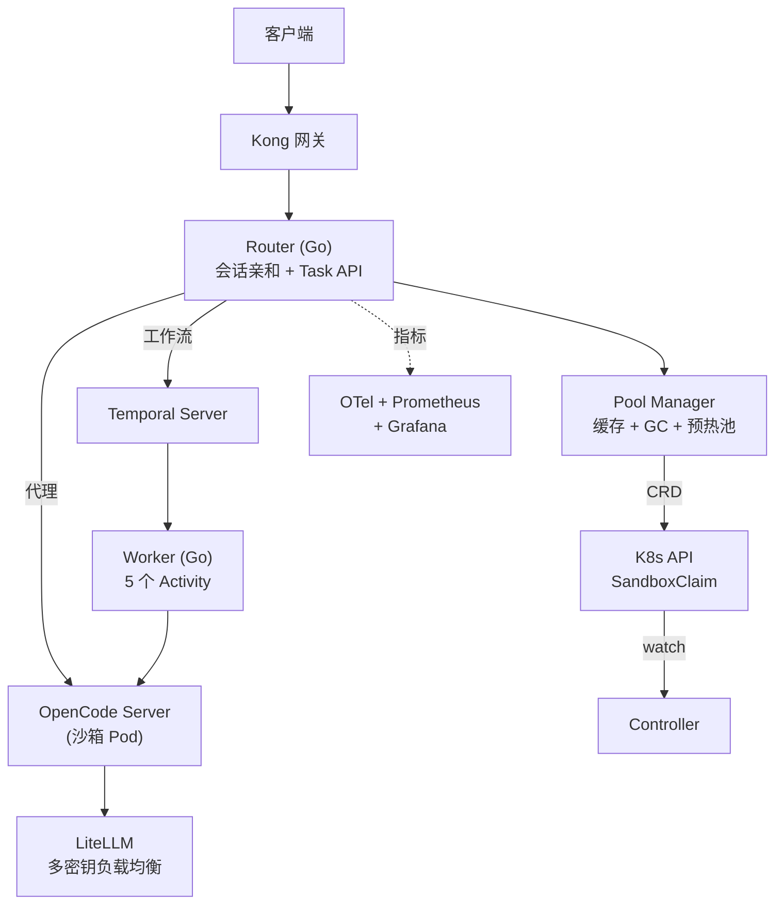

# opencode-scale

[English](README.md) | [中文](README.zh-CN.md)

[OpenCode Server](https://github.com/opencode-ai/opencode) 的生产级编排层，支持从数百到数千并发 Agent 会话的横向扩展。

## 架构



## 组件

| 组件 | 职责 |
|------|------|
| **Router** | HTTP 网关，会话亲和路由，反向代理，Task API，SSE 流式推送 |
| **Controller** | K8s 控制器，管理 SandboxClaim 生命周期和 GC |
| **Worker** | Temporal 工作节点，执行 5 步编码任务工作流 |
| **Pool Manager** | 沙箱池，warm 实例预分配，GC 循环，自动补充 |

## 技术栈

- **Go 1.25** — 核心编排代码
- **Kong 3.x** — API 网关（限流、认证、可观测性）
- **Temporal 1.24+** — 工作流编排（重试、超时、心跳）
- **Agent Sandbox** (kubernetes-sigs) — gVisor 隔离沙箱环境
- **LiteLLM** — 多供应商 LLM 代理（密钥轮换）
- **OpenTelemetry + Prometheus + Grafana** — 完整可观测性栈

## 快速开始

### 前置条件

- Go 1.25+
- Docker

### 本地开发（Docker Compose）

```bash
# 启动所有服务（Temporal、mock-opencode、router、worker）
make compose-up

# 验证
curl -s http://localhost:8080/health | jq .

# 导入测试数据
make seed

# 查看日志
make compose-logs

# 停止
make compose-down
```

### 源码构建

```bash
make deps     # 下载依赖
make build    # 构建全部 5 个二进制
make test     # 运行测试（含 race 检测）
```

### K8s 部署

```bash
# Helm
helm install opencode-scale ./charts/opencode-scale \
  --namespace opencode-scale --create-namespace

# Kustomize
make deploy-dev   # 开发环境 overlay
make deploy-prod  # 生产环境 overlay
```

## API 使用

```bash
# 提交编码任务
curl -X POST http://localhost:8080/api/v1/tasks \
  -H "Content-Type: application/json" \
  -H "X-API-Key: your-key" \
  -d '{
    "prompt": "写一个整数排序函数",
    "timeout": 300
  }'

# 查询任务状态
curl http://localhost:8080/api/v1/tasks/{taskId}

# 实时流式推送任务进度（SSE）
curl -N http://localhost:8080/api/v1/tasks/{taskId}/stream

# 健康检查
curl http://localhost:8080/health
```

## 项目结构

```
cmd/
  router/          HTTP 网关，会话亲和路由
  controller/      K8s 控制器，SandboxClaim 生命周期管理
  worker/          Temporal 工作流 Worker
  mock-opencode/   模拟 OpenCode Server（SSE 流式响应）
  mock-llm-api/    模拟 OpenAI API（带限流）
internal/
  config/          统一配置系统（YAML + 环境变量覆盖）
  pool/            沙箱池管理（缓存、GC、warm pool）
  router/          HTTP 路由、代理、中间件、Task API
  workflow/        Temporal 工作流和 Activity 定义
  opencode/        OpenCode HTTP 客户端（SSE 解析）
  schema/          JSON Schema 校验
  controller/      K8s reconciler + 指标
  telemetry/       OpenTelemetry 插桩
api/v1/            API 类型和 OpenAPI 规范
deploy/            Kubernetes 清单（Kustomize）
charts/            Helm Chart
hack/              开发脚本
```

## 配置

配置从 YAML 文件加载，支持环境变量覆盖：

| 环境变量 | 默认值 | 说明 |
|---------|--------|------|
| `POOL_MODE` | `local` | `local`（模拟）或 `k8s`（真实沙箱） |
| `POOL_MIN_READY` | `3` | warm 沙箱实例数 |
| `POOL_MAX_SIZE` | `50` | 最大沙箱实例数 |
| `POOL_IDLE_TIMEOUT` | `10m` | 空闲沙箱回收超时 |
| `ROUTER_LISTEN_ADDR` | `:8080` | Router 监听地址 |
| `API_KEYS` | _(空)_ | 逗号分隔的 API Key（空=禁用认证） |
| `MAX_BODY_BYTES` | `1048576` | 最大请求体大小（1 MB） |
| `TEMPORAL_HOST_PORT` | `localhost:7233` | Temporal 服务地址 |
| `OTEL_ENDPOINT` | `localhost:4317` | OTel Collector 端点 |
| `LITELLM_ENDPOINT` | `http://localhost:4000` | LiteLLM 代理端点 |

完整配置参考见 [docs/configuration.md](docs/configuration.md)。

## 安全

- **API Key 认证** — Bearer Token 或 `X-API-Key` 请求头。`apiKeys` 为空时禁用。
- **请求体大小限制** — 默认 1 MB，使用 `http.MaxBytesReader`。
- **审计日志** — 每个请求记录 method、path、status、duration、user ID。
- **沙箱隔离** — 基于 gVisor 的容器，通过 Agent Sandbox CRD 管理。

## 可观测性

预配置的 Grafana 仪表板位于 `deploy/base/otel/grafana/`：

- 池利用率和分配延迟
- 任务吞吐量和时长分位数
- 队列深度和等待时间
- LLM Token 使用速率

Docker Compose 模式下 Temporal UI 在 `http://localhost:8233`，可查看工作流执行详情。

## 文档

- [架构设计](docs/architecture.zh-CN.md) — 系统设计、组件交互、请求流程
- [快速上手](docs/getting-started.zh-CN.md) — 安装、API 参考、部署、故障排查
- [配置参考](docs/configuration.md) — 完整配置文档

## 许可证

Apache 2.0
