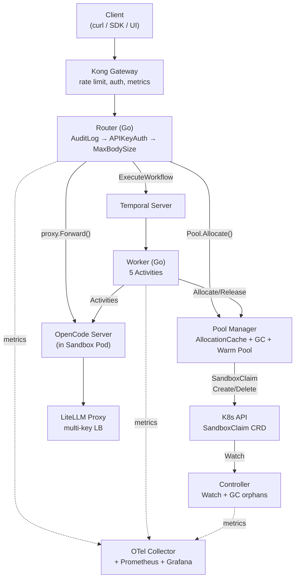
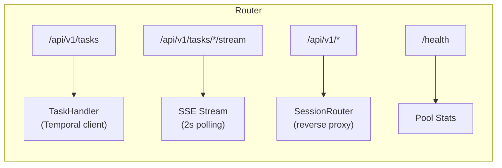
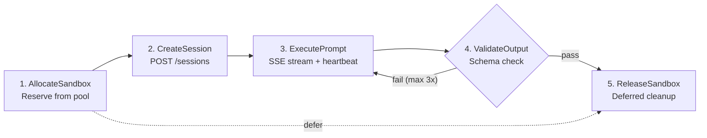
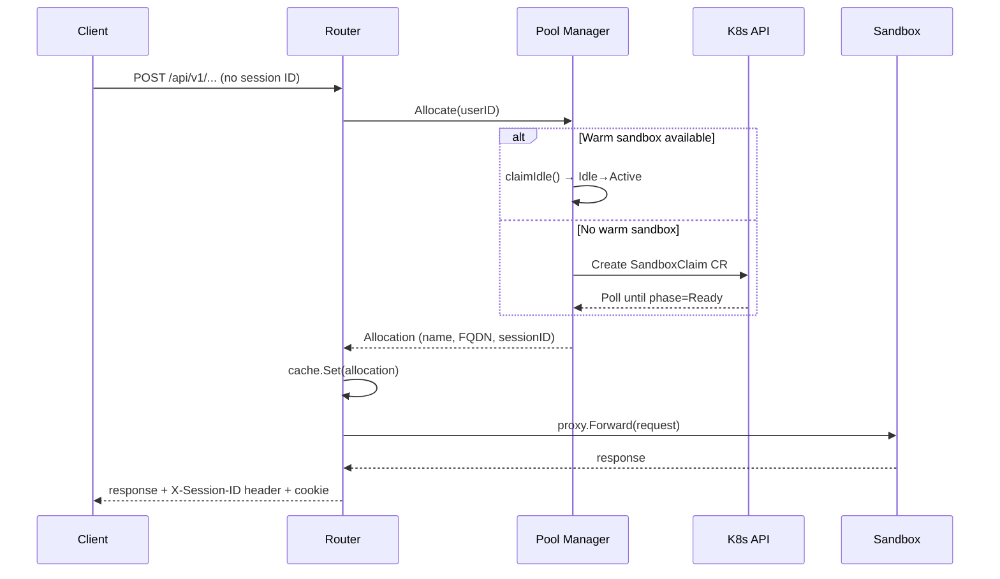
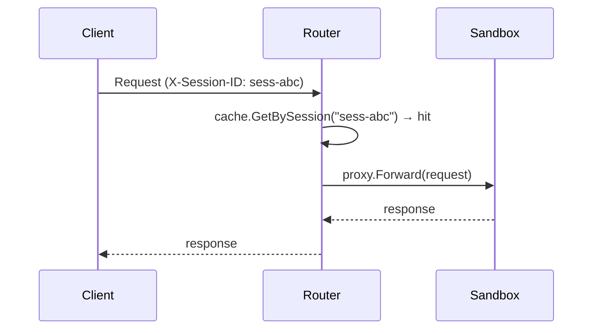
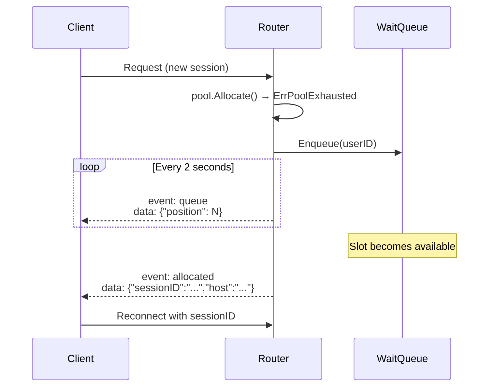
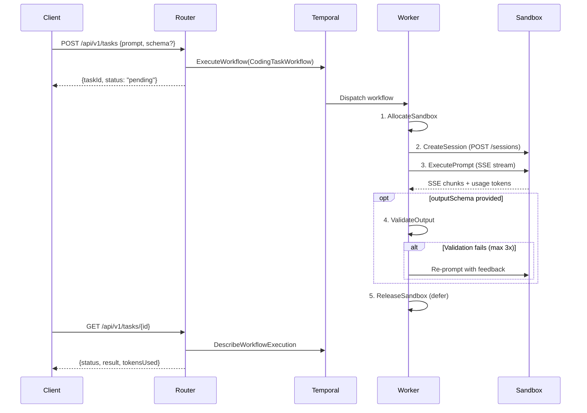
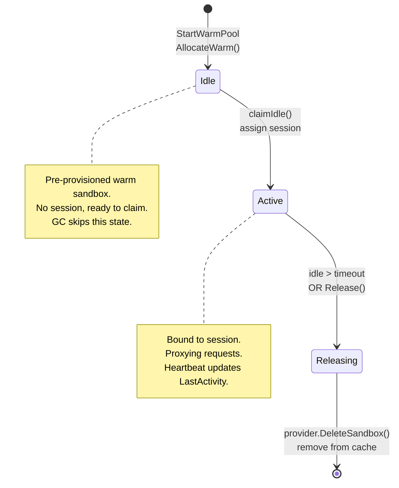
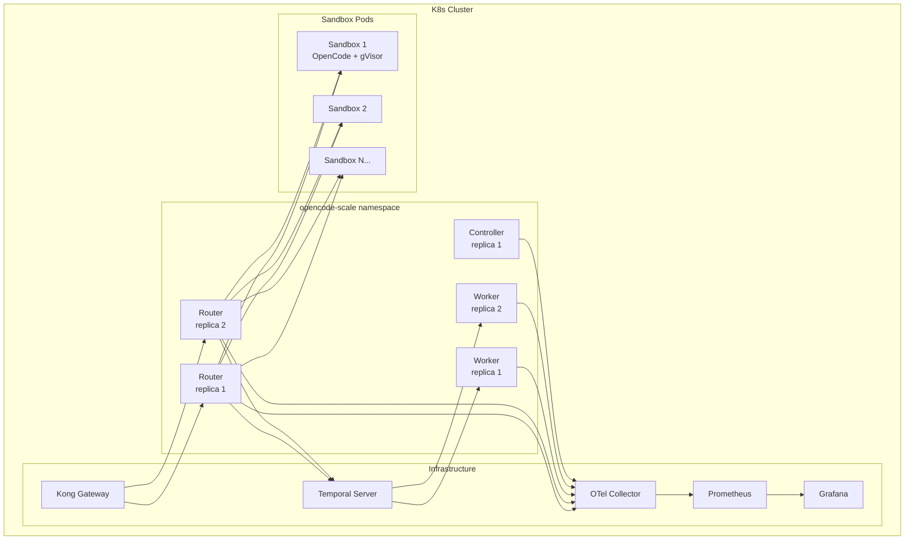
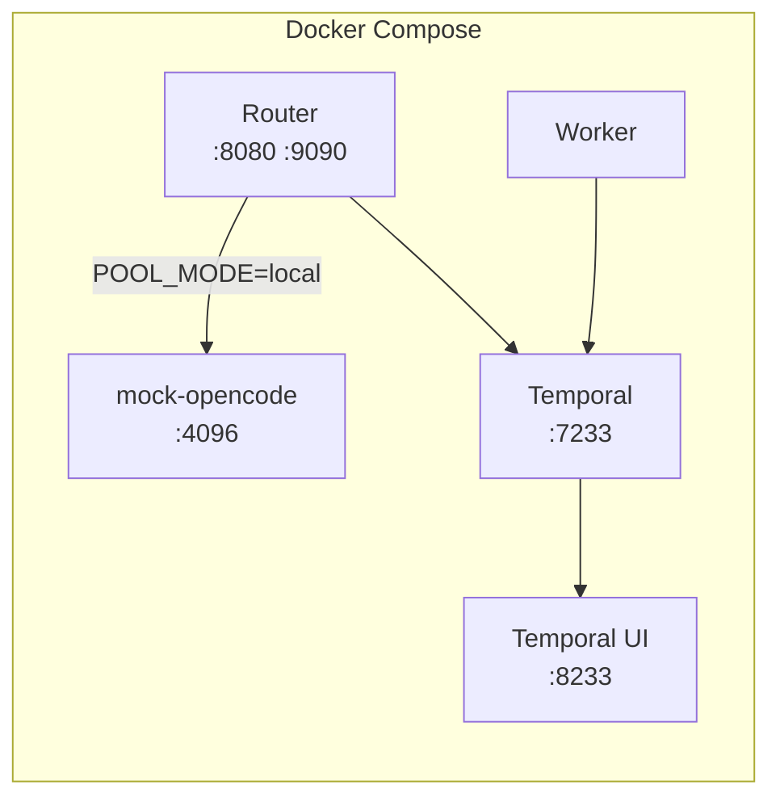

# Architecture

[English](architecture.md) | [中文](architecture.zh-CN.md)

## Overview

opencode-scale is a production-grade orchestration layer for [OpenCode Server](https://github.com/opencode-ai/opencode), scaling from hundreds to thousands of concurrent AI agent sessions. It manages isolated sandbox environments, routes requests with session affinity, orchestrates multi-step coding task workflows, and provides full observability.

The system consists of three production binaries (`router`, `controller`, `worker`) backed by Temporal for workflow orchestration, Agent Sandbox CRDs for isolated execution environments, LiteLLM for multi-provider LLM access, and an OTel/Prometheus/Grafana observability stack.

## System Topology



### Routes



## Components

### Router (`cmd/router`)

HTTP gateway, the only client-facing entry point. Performs two roles:

**1. Session-affine reverse proxy**

Extracts session ID from request header (`X-Session-ID`), cookie (`session_id`), or query param (`session_id`). Lookup order: header > cookie > query, first non-empty value wins.

- **Fast path** — Session found in `AllocationCache` → proxy directly to sandbox FQDN via `httputil.ReverseProxy`.
- **Slow path** — New request → tries to claim an idle warm sandbox (`claimIdle`), otherwise creates a new sandbox via the `SandboxProvider` and returns the session ID in the `X-Session-ID` header and `session_id` cookie.
- **Pool exhausted** — Enqueues the request in `WaitQueue` and streams SSE position updates until a slot opens.

Reverse proxy instances are cached per target host (`sync.Map`) for HTTP connection reuse.

**2. Task API (Temporal)**

- `POST /api/v1/tasks` — Starts a `CodingTaskWorkflow` on Temporal, returns `{taskId, status: "pending"}`.
- `GET /api/v1/tasks/{taskId}` — Queries workflow execution status via `DescribeWorkflowExecution`.
- `GET /api/v1/tasks/{taskId}/stream` — SSE endpoint that polls Temporal every 2 seconds, emitting `event: status` (while running) or `event: result` (on completion/failure).

**3. Middleware chain** (outermost → innermost)

| Layer | Purpose |
|-------|---------|
| `AuditLog` | Logs every request: method, path, status, duration_ms, remote IP, user ID |
| `APIKeyAuth` | Validates `Authorization: Bearer {key}` or `X-API-Key: {key}`. Bypasses `/health`. Disabled when `apiKeys` is empty. |
| `MaxBodySize` | Limits request body via `http.MaxBytesReader`. Default 1 MB. |

### Worker (`cmd/worker`)

Temporal worker process. Registers `CodingTaskWorkflow` and 5 activity implementations. Connects to Temporal on the `coding-tasks` task queue. Dependencies injected into the `Activities` struct:

- `Pool` — `*PoolManager` for sandbox allocation/release
- `Validator` — `*schema.Validator` for JSON Schema validation
- `Metrics` — `*WorkflowMetrics` for token/duration counters

### Controller (`cmd/controller`)

Kubernetes controller that watches `SandboxClaim` CRDs (`agents.x-k8s.io/v1alpha1`) via dynamic informer. Filtered by label `app.kubernetes.io/managed-by=opencode-scale`.

- Logs lifecycle events (Add/Update/Delete).
- Records claim phase transition metrics.
- GC loop (every 60s): deletes claims in `Failed` or `Completed` phase older than `gcTimeout` (10 min).

### Pool Manager (`internal/pool`)

Manages sandbox allocation and release with an in-memory `AllocationCache` dual-indexed by `sandboxName` and `sessionID`.

Key behaviors:

| Operation | Description |
|-----------|-------------|
| `Allocate(userID)` | Try `claimIdle()` (warm sandbox) → otherwise `provider.CreateSandbox()` → cache + metrics |
| `Release(sandboxName)` | Mark `StatusReleasing` → `provider.DeleteSandbox()` → cache remove |
| `Heartbeat(sessionID)` | Update `LastActivity` timestamp |
| `RunGC(idleTimeout)` | Scan all allocations, release active ones idle > timeout, skip warm (StatusIdle) |
| `AllocateWarm()` | Create sandbox with `StatusIdle`, no session — pre-provisioned and ready to claim |
| `StartWarmPool(minReady, interval)` | Goroutine: ticker checks idle count, calls `AllocateWarm` to fill up to `minReady` |
| `StartGCLoop(interval, idleTimeout)` | Goroutine: ticker calls `RunGC` periodically |

**SandboxProvider interface:**

```go
type SandboxProvider interface {
    CreateSandbox(ctx context.Context) (name, fqdn string, err error)
    DeleteSandbox(ctx context.Context, name string) error
}
```

Two implementations:
- `K8sSandboxProvider` — Creates `SandboxClaim` CRs, polls until `status.phase == Ready`, builds FQDN `{sandboxName}.{namespace}.svc.cluster.local:4096`.
- `MockSandboxProvider` — Returns fixed FQDN (configured `mockTarget`). For local development.

### Temporal Workflow (`internal/workflow`)

`CodingTaskWorkflow` — 5-step durable workflow:



**Activity retry policies:**

| Activity | Max Attempts | Initial Interval | Backoff | Notes |
|----------|-------------|-------------------|---------|-------|
| AllocateSandbox | 3 | 5s | 2.0x | Non-retryable on pool exhaustion |
| CreateSession | 3 | 2s | 2.0x | HTTP transient failures |
| ExecutePrompt | 1 | — | — | Long LLM call, heartbeat 1min |
| ValidateOutput | 1 | — | — | Retry managed by workflow loop |
| ReleaseSandbox | 3 | 5s | 2.0x | Best-effort cleanup |

**Schema validation retry loop:** When `outputSchema` is provided, failed validation triggers a re-prompt with the original request, failed output, validation error feedback, and the schema. Up to 3 attempts.

**Token counting:** `ExecutePromptActivity` extracts token usage from SSE `usage.total_tokens` field, with `X-Usage-Total-Tokens` header as fallback.

### OpenCode Client (`internal/opencode`)

HTTP client for communicating with OpenCode Server inside sandboxes.

- `CreateSession(ctx)` → `POST /sessions`
- `SendMessage(ctx, sessionID, prompt, heartbeatFn)` → `POST /sessions/{id}/messages`

SSE parsing:
- Accumulates multi-line `data:` fields into a buffer (up to 1 MB per line).
- Empty line triggers event processing.
- `[DONE]` terminates the stream.
- Calls `heartbeatFn` every 10 events (maps to Temporal `activity.RecordHeartbeat`).
- Returns `SendResult{Content, TokensUsed}`.

### JSON Schema Validation (`internal/schema`)

- `ExtractJSON(text)` — Finds first valid JSON object/array in LLM output using depth-counting parser. Handles markdown code blocks and extraneous text.
- `ValidateWithFeedback(data, schema)` — Extracts JSON, validates against schema, returns structured `ValidationResult` with pass/fail and human-readable feedback.
- `BuildRetryPrompt(original, failed, feedback, schema)` — Constructs a re-prompt for the LLM with context about what went wrong.

### Telemetry (`internal/telemetry`)

Initializes all three observability pillars:

| Pillar | Implementation | Endpoint |
|--------|---------------|----------|
| Tracing | OTLP/gRPC exporter → OTel Collector | Configurable endpoint |
| Metrics | Prometheus pull exporter | `:9090/metrics` |
| Logging | `slog.NewJSONHandler(os.Stdout)` | stdout |

Per-package tracers: `otel.Tracer("opencode-scale/pool")`, `otel.Tracer("opencode-scale/router")`, etc.

Exported Prometheus metrics:

| Metric | Type | Source |
|--------|------|--------|
| `opencode_scale_pool_size` | Gauge | Pool |
| `opencode_scale_allocated_count` | Gauge | Pool |
| `opencode_scale_wait_queue_length` | Gauge | Pool |
| `opencode_scale_allocation_latency` | Histogram (s) | Pool |
| `opencode_scale_task_duration` | Histogram (s) | Workflow |
| `opencode_scale_task_status` | Counter (by status) | Workflow |
| `opencode_scale_llm_tokens_total` | Counter | Workflow |
| `opencode_scale_sandbox_claims_total` | Counter (by phase) | Controller |
| `opencode_scale_gc_deletions_total` | Counter | Controller |

## Request Flows

### New Session (Direct Proxy)



### Existing Session (Fast Path)



### Pool Exhausted (Queue + SSE)



### Temporal Workflow (Task API)



## Sandbox Lifecycle



- **Warm Pool**: `StartWarmPool` goroutine runs on a ticker, counts idle sandboxes, calls `AllocateWarm()` to fill up to `MinReady`. Only active in K8s mode.
- **GC Loop**: `StartGCLoop` runs on a ticker, scans all allocations. Releases active allocations idle longer than `idleTimeout`. Skips `StatusIdle` (warm) and `StatusReleasing`.
- **Controller GC**: Separate loop that cleans up orphaned `SandboxClaim` CRs in terminal states (`Failed`/`Completed`), older than 10 minutes.

## Key Design Decisions

### Temporal for Orchestration

Multi-step coding tasks (allocate → session → execute → validate → release) need durable execution guarantees. Temporal handles retries, timeouts, heartbeats, and crash recovery declaratively. The activity heartbeat mechanism maps directly to SSE streaming — if a worker dies mid-execution, Temporal detects the missed heartbeat and reschedules.

### Agent Sandbox for Isolation

`kubernetes-sigs/agent-sandbox` provides gVisor-isolated containers via Kubernetes CRDs. Each OpenCode Server gets a hard security boundary (no shared kernel). The `SandboxWarmPool` CRD pre-provisions containers so allocation latency drops from minutes to seconds.

### Dual-Index Cache

`AllocationCache` indexes by both `sandboxName` and `sessionID`, providing O(1) lookups in both directions. Avoids external session stores while keeping routing deterministic within a single router instance.

### Warm Pool + Claim Pattern

Pre-allocated idle sandboxes (`StatusIdle`) are maintained at `MinReady` count. When a new session arrives, `claimIdle()` atomically transitions an idle sandbox to active — no K8s API call needed. This eliminates cold-start latency for the common case.

### Session Affinity at Router Level

The Router extracts session IDs from multiple sources (header, cookie, query param) to support different client types. Proxy instances are cached per target host using `sync.Map` for connection reuse.

### Provider Mode Toggle

`Pool.Mode` (`"local"` / `"k8s"`) switches between `MockSandboxProvider` and `K8sSandboxProvider` via a single config field. Local mode needs no K8s cluster — useful for development and testing.

### Middleware Composition

Security concerns (audit logging, authentication, request size limits) are separated into composable middleware functions, applied as a chain. Each can be independently enabled/disabled via configuration.

### Deferred Cleanup with Disconnected Context

The workflow always releases its sandbox via a deferred cleanup using Temporal's `DisconnectedContext`. Even if the workflow is cancelled or times out, the cleanup activity runs in a new context unaffected by the original cancellation.

## Deployment Architecture

### Production (K8s + Helm)



| Component | Replicas | Resources | Ports |
|-----------|----------|-----------|-------|
| Router | 2 | 200m-1 CPU, 256Mi-1Gi | 8080 (HTTP), 9090 (metrics) |
| Worker | 2 | 200m-1 CPU, 256Mi-1Gi | 9090 (metrics) |
| Controller | 1 | 100m-500m CPU, 128Mi-512Mi | 9090 (metrics) |

### Local Development (Docker Compose)



5 services: Temporal + UI, mock-opencode, Router, Worker. All configured via `POOL_MODE=local` to use mock provider.

Optional rate-limit testing overlay adds `mock-llm-api` and `litellm` services.

## Project Structure

```
cmd/
  router/          HTTP gateway with session affinity
  controller/      K8s controller for SandboxClaim lifecycle
  worker/          Temporal workflow worker
  mock-opencode/   Mock OpenCode Server (SSE streaming)
  mock-llm-api/    Mock OpenAI API with rate limiting
internal/
  config/          Unified configuration (YAML + env overrides)
  pool/            Sandbox pool management (cache, GC, warm pool)
  router/          HTTP routing, proxy, middleware, task API
  workflow/        Temporal workflow and activity definitions
  opencode/        OpenCode HTTP client (SSE parsing)
  schema/          JSON Schema validation + retry prompt
  controller/      K8s reconciler + controller metrics
  telemetry/       OTel tracing + Prometheus metrics + slog
api/v1/            API types (TaskRequest, TaskResponse, etc.)
deploy/            Kubernetes manifests (Kustomize base + overlays)
charts/            Helm chart (Router + Worker + Controller)
hack/              Development scripts (setup, seed, bench)
```
