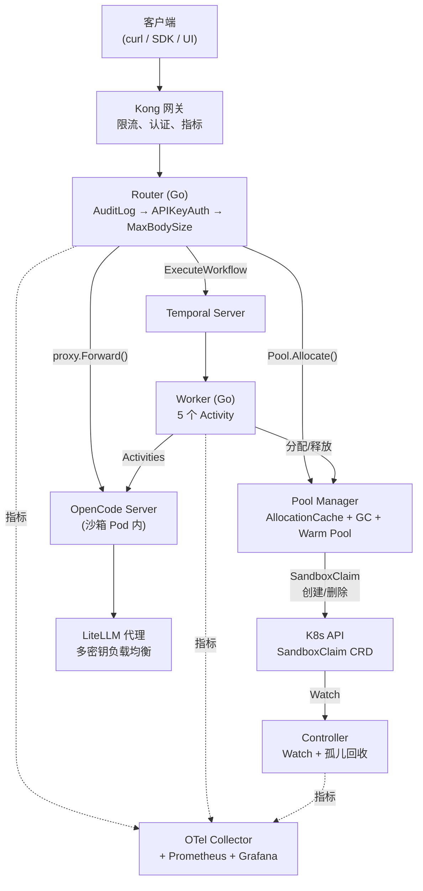
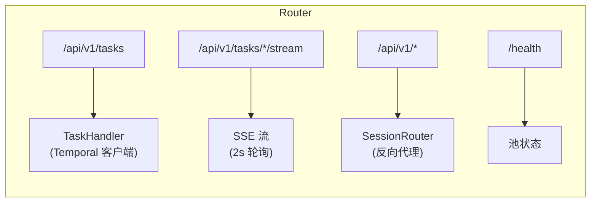
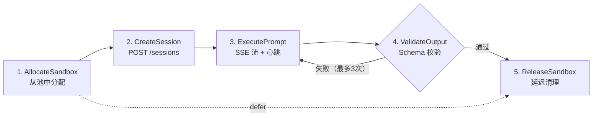
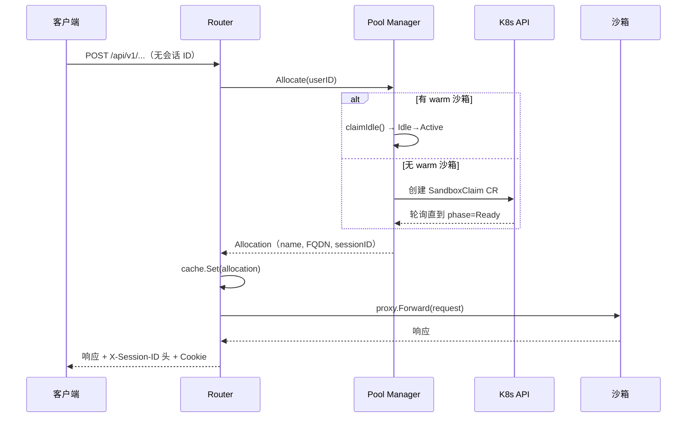
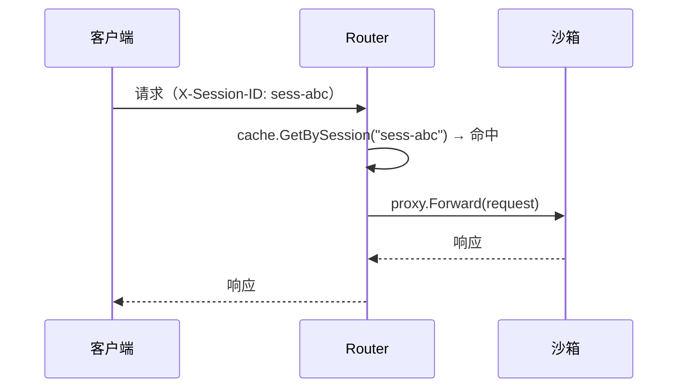
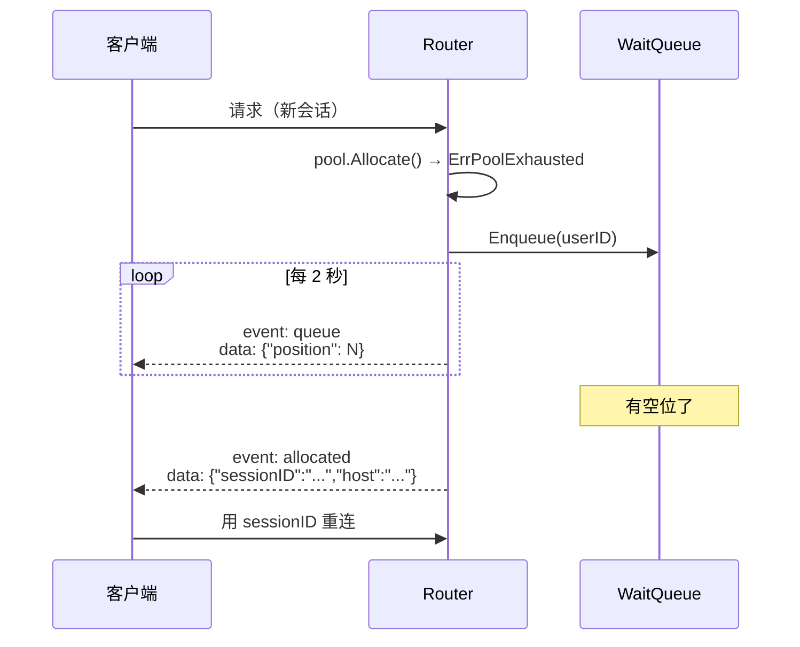
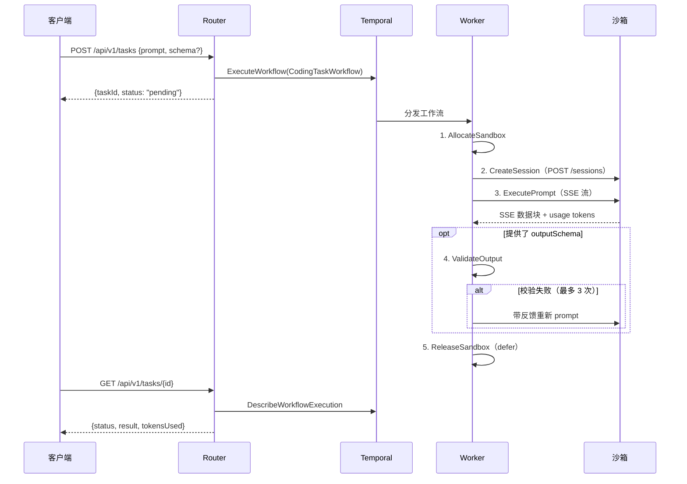
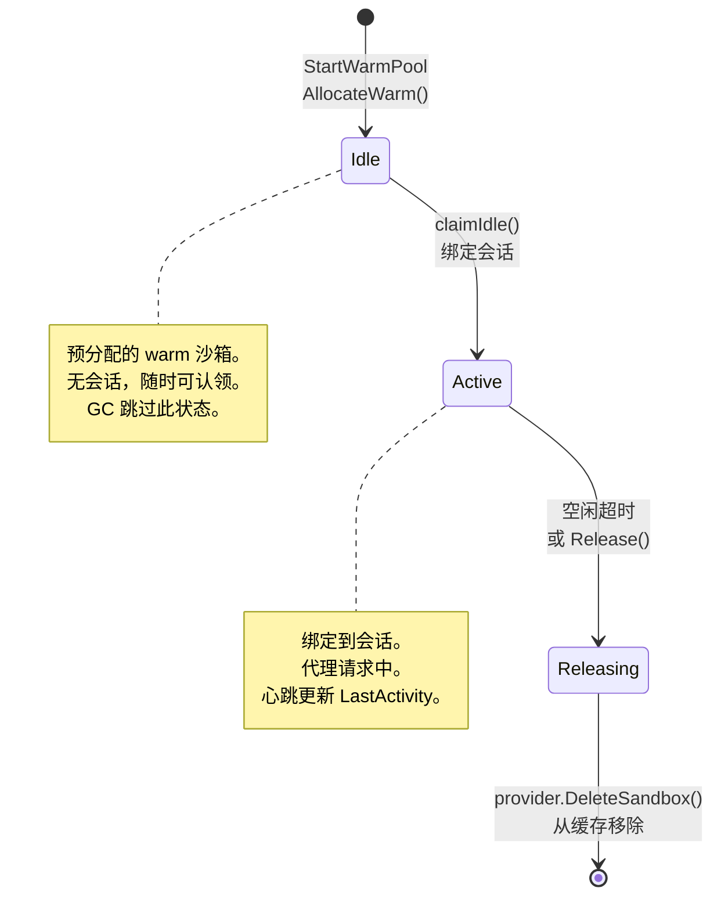
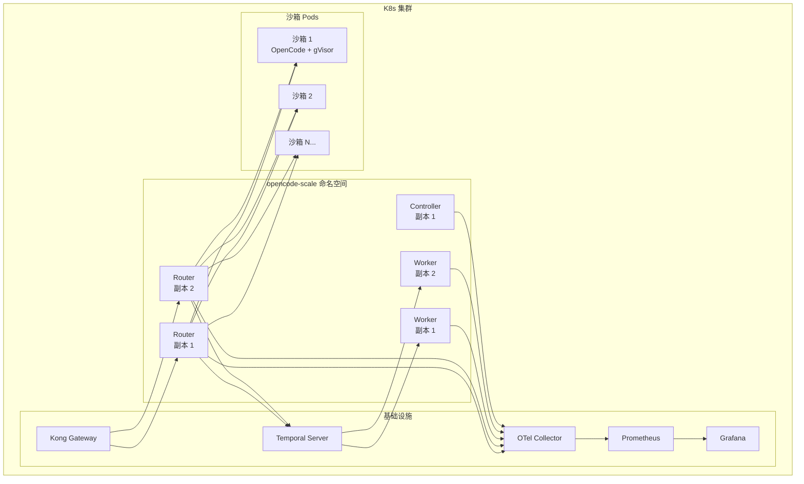
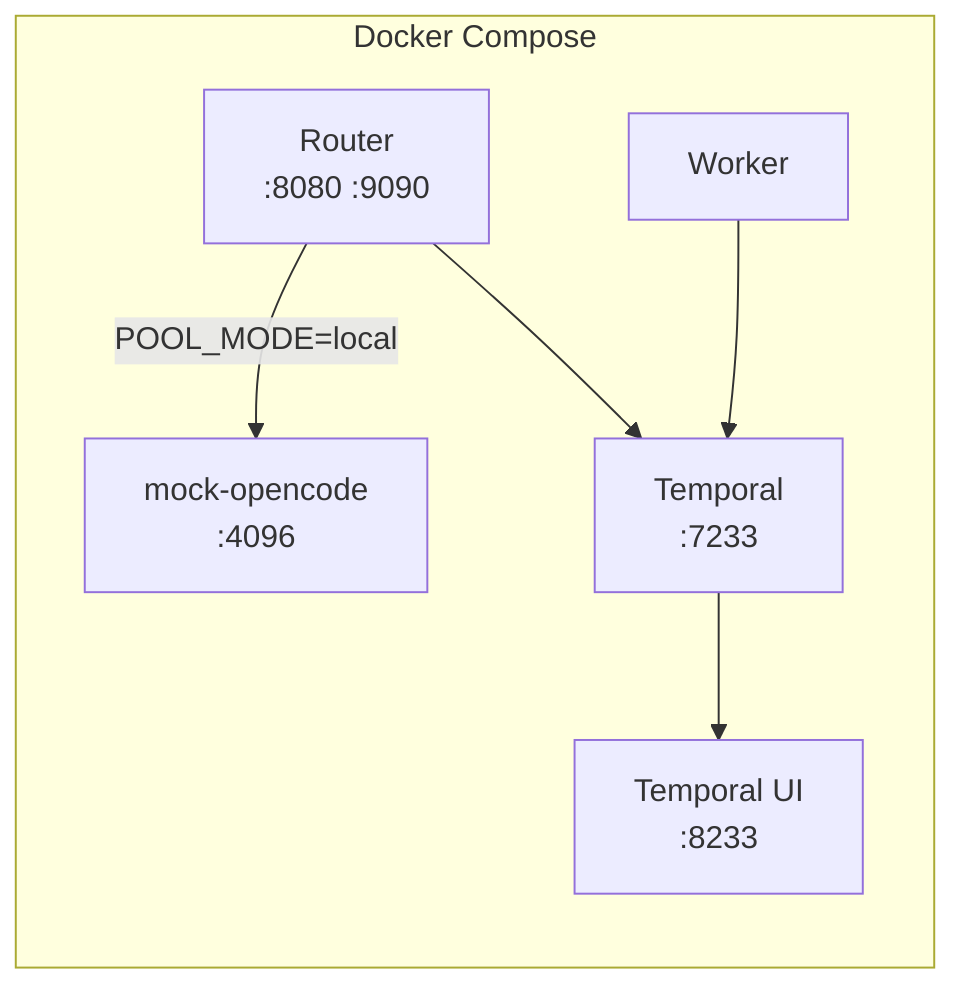

# 架构设计

[English](architecture.md) | [中文](architecture.zh-CN.md)

## 概述

opencode-scale 是 [OpenCode Server](https://github.com/opencode-ai/opencode) 的生产级编排层，支持从数百到数千并发 AI Agent 会话的横向扩展。它管理隔离的沙箱环境，提供会话亲和路由，编排多步骤编码任务工作流，并具备完整的可观测性。

系统由三个生产二进制（`router`、`controller`、`worker`）组成，底层依赖 Temporal 进行工作流编排、Agent Sandbox CRD 提供隔离执行环境、LiteLLM 实现多供应商 LLM 接入，以及 OTel/Prometheus/Grafana 可观测性栈。

## 系统拓扑



### 路由表



## 组件说明

### Router (`cmd/router`)

HTTP 网关，唯一的客户端入口。承担两个角色：

**1. 会话亲和反向代理**

从请求头（`X-Session-ID`）、Cookie（`session_id`）或查询参数（`session_id`）提取会话 ID。优先级：请求头 > Cookie > 查询参数，取第一个非空值。

- **快路径** — 会话已在 `AllocationCache` 中 → 直接通过 `httputil.ReverseProxy` 代理到沙箱 FQDN。
- **慢路径** — 新请求 → 尝试认领空闲 warm 沙箱（`claimIdle`），否则通过 `SandboxProvider` 创建新沙箱，在 `X-Session-ID` 响应头和 `session_id` Cookie 中返回会话 ID。
- **池满** — 将请求入队到 `WaitQueue`，通过 SSE 推送排队位置，直到有空位。

反向代理实例按目标主机缓存（`sync.Map`），复用 HTTP 连接。

**2. Task API（Temporal）**

- `POST /api/v1/tasks` — 在 Temporal 上启动 `CodingTaskWorkflow`，返回 `{taskId, status: "pending"}`。
- `GET /api/v1/tasks/{taskId}` — 通过 `DescribeWorkflowExecution` 查询工作流状态。
- `GET /api/v1/tasks/{taskId}/stream` — SSE 端点，每 2 秒轮询 Temporal，推送 `event: status`（运行中）或 `event: result`（完成/失败）。

**3. 中间件链**（从外到内）

| 层级 | 功能 |
|------|------|
| `AuditLog` | 记录每个请求：method、path、status、duration_ms、远端 IP、用户 ID |
| `APIKeyAuth` | 校验 `Authorization: Bearer {key}` 或 `X-API-Key: {key}`。跳过 `/health`。`apiKeys` 为空时禁用。 |
| `MaxBodySize` | 通过 `http.MaxBytesReader` 限制请求体大小。默认 1 MB。 |

### Worker (`cmd/worker`)

Temporal 工作节点。注册 `CodingTaskWorkflow` 和 5 个 Activity 实现。连接 Temporal 的 `coding-tasks` 任务队列。依赖注入到 `Activities` 结构体：

- `Pool` — `*PoolManager`，用于沙箱分配/释放
- `Validator` — `*schema.Validator`，用于 JSON Schema 校验
- `Metrics` — `*WorkflowMetrics`，用于 token/时长计数

### Controller (`cmd/controller`)

Kubernetes 控制器，通过 dynamic informer 监听 `SandboxClaim` CRD（`agents.x-k8s.io/v1alpha1`）。按标签 `app.kubernetes.io/managed-by=opencode-scale` 过滤。

- 记录生命周期事件（Add/Update/Delete）。
- 记录 Claim 阶段转换指标。
- GC 循环（每 60s）：删除处于 `Failed` 或 `Completed` 阶段且超过 `gcTimeout`（10 分钟）的 Claim。

### Pool Manager (`internal/pool`)

使用内存中的 `AllocationCache` 管理沙箱分配和释放，按 `sandboxName` 和 `sessionID` 双索引。

核心操作：

| 操作 | 说明 |
|------|------|
| `Allocate(userID)` | 先尝试 `claimIdle()`（warm 沙箱）→ 否则 `provider.CreateSandbox()` → 缓存 + 指标 |
| `Release(sandboxName)` | 标记 `StatusReleasing` → `provider.DeleteSandbox()` → 从缓存删除 |
| `Heartbeat(sessionID)` | 更新 `LastActivity` 时间戳 |
| `RunGC(idleTimeout)` | 扫描所有分配，释放空闲超过阈值的活跃沙箱，跳过 warm（StatusIdle） |
| `AllocateWarm()` | 创建 `StatusIdle` 沙箱，无会话——预分配，随时可认领 |
| `StartWarmPool(minReady, interval)` | 协程：定时检查空闲数，调用 `AllocateWarm` 填充至 `minReady` |
| `StartGCLoop(interval, idleTimeout)` | 协程：定时调用 `RunGC` |

**SandboxProvider 接口：**

```go
type SandboxProvider interface {
    CreateSandbox(ctx context.Context) (name, fqdn string, err error)
    DeleteSandbox(ctx context.Context, name string) error
}
```

两个实现：
- `K8sSandboxProvider` — 创建 `SandboxClaim` CR，轮询直到 `status.phase == Ready`，构建 FQDN `{sandboxName}.{namespace}.svc.cluster.local:4096`。
- `MockSandboxProvider` — 返回固定 FQDN（配置的 `mockTarget`）。用于本地开发。

### Temporal 工作流 (`internal/workflow`)

`CodingTaskWorkflow` — 5 步持久化工作流：



**Activity 重试策略：**

| Activity | 最大尝试次数 | 初始间隔 | 退避系数 | 备注 |
|----------|-------------|---------|---------|------|
| AllocateSandbox | 3 | 5s | 2.0x | 池满时不重试 |
| CreateSession | 3 | 2s | 2.0x | HTTP 瞬断 |
| ExecutePrompt | 1 | — | — | 长时 LLM 调用，心跳 1min |
| ValidateOutput | 1 | — | — | 重试由工作流循环管理 |
| ReleaseSandbox | 3 | 5s | 2.0x | 尽力清理 |

**Schema 校验重试循环：** 当提供 `outputSchema` 时，校验失败会触发重新 prompt，包含原始请求、失败输出、校验错误反馈和 Schema。最多 3 轮。

**Token 计数：** `ExecutePromptActivity` 从 SSE 的 `usage.total_tokens` 字段提取 token 用量，备选方案为 `X-Usage-Total-Tokens` 响应头。

### OpenCode 客户端 (`internal/opencode`)

与沙箱内 OpenCode Server 通信的 HTTP 客户端。

- `CreateSession(ctx)` → `POST /sessions`
- `SendMessage(ctx, sessionID, prompt, heartbeatFn)` → `POST /sessions/{id}/messages`

SSE 解析：
- 将多行 `data:` 字段累积到缓冲区（每行最大 1 MB）。
- 空行触发事件处理。
- `[DONE]` 终止流。
- 每 10 个事件调用 `heartbeatFn`（映射到 Temporal `activity.RecordHeartbeat`）。
- 返回 `SendResult{Content, TokensUsed}`。

### JSON Schema 校验 (`internal/schema`)

- `ExtractJSON(text)` — 使用深度计数解析器在 LLM 输出中查找第一个有效 JSON 对象/数组。处理 markdown 代码块和多余文本。
- `ValidateWithFeedback(data, schema)` — 提取 JSON，对照 Schema 校验，返回带通过/失败和可读反馈的 `ValidationResult`。
- `BuildRetryPrompt(original, failed, feedback, schema)` — 构造重试 prompt，包含失败原因的上下文。

### 遥测 (`internal/telemetry`)

初始化三大可观测性支柱：

| 支柱 | 实现 | 端点 |
|------|------|------|
| 追踪 | OTLP/gRPC 导出器 → OTel Collector | 可配置端点 |
| 指标 | Prometheus Pull 导出器 | `:9090/metrics` |
| 日志 | `slog.NewJSONHandler(os.Stdout)` | stdout |

每包独立 Tracer：`otel.Tracer("opencode-scale/pool")`、`otel.Tracer("opencode-scale/router")` 等。

导出的 Prometheus 指标：

| 指标 | 类型 | 来源 |
|------|------|------|
| `opencode_scale_pool_size` | Gauge | Pool |
| `opencode_scale_allocated_count` | Gauge | Pool |
| `opencode_scale_wait_queue_length` | Gauge | Pool |
| `opencode_scale_allocation_latency` | Histogram (s) | Pool |
| `opencode_scale_task_duration` | Histogram (s) | Workflow |
| `opencode_scale_task_status` | Counter（按状态） | Workflow |
| `opencode_scale_llm_tokens_total` | Counter | Workflow |
| `opencode_scale_sandbox_claims_total` | Counter（按阶段） | Controller |
| `opencode_scale_gc_deletions_total` | Counter | Controller |

## 请求流程

### 新会话（直接代理）



### 已有会话（快路径）



### 池满（排队 + SSE）



### Temporal 工作流（Task API）



## 沙箱生命周期



- **Warm Pool**：`StartWarmPool` 协程定时运行，计算空闲沙箱数，调用 `AllocateWarm()` 填充至 `MinReady`。仅 K8s 模式激活。
- **GC 循环**：`StartGCLoop` 定时运行，扫描所有分配。释放空闲超过 `idleTimeout` 的活跃分配。跳过 `StatusIdle`（warm）和 `StatusReleasing`。
- **Controller GC**：独立循环，清理处于终态（`Failed`/`Completed`）且超过 10 分钟的孤儿 `SandboxClaim` CR。

## 关键设计决策

### 为什么用 Temporal

多步骤编码任务（分配 → 会话 → 执行 → 验证 → 释放）需要持久化执行保证。Temporal 声明式地处理重试、超时、心跳和崩溃恢复。Activity 心跳机制直接映射到 SSE 流 — 如果 Worker 在执行中挂掉，Temporal 检测到心跳丢失后会重新调度。

### 为什么用 Agent Sandbox

`kubernetes-sigs/agent-sandbox` 通过 Kubernetes CRD 提供 gVisor 隔离容器。每个 OpenCode Server 获得硬安全边界（不共享内核）。`SandboxWarmPool` CRD 预置容器，使分配延迟从分钟级降到秒级。

### 双索引缓存

`AllocationCache` 同时按 `sandboxName` 和 `sessionID` 索引，双向 O(1) 查找。避免外部会话存储，同时保持单 Router 实例内路由的确定性。

### Warm Pool + Claim 模式

预分配的空闲沙箱（`StatusIdle`）维持在 `MinReady` 数量。新会话到来时，`claimIdle()` 原子地将空闲沙箱转为活跃 — 无需 K8s API 调用。消除了常见情况下的冷启动延迟。

### Router 层面的会话亲和

Router 从多个来源（请求头、Cookie、查询参数）提取会话 ID，支持不同类型的客户端。代理实例按目标主机使用 `sync.Map` 缓存，复用连接。

### Provider 模式切换

`Pool.Mode`（`"local"` / `"k8s"`）通过单个配置字段切换 `MockSandboxProvider` 和 `K8sSandboxProvider`。本地模式无需 K8s 集群 — 适合开发和测试。

### 中间件组合

安全关注点（审计日志、认证、请求体大小限制）分离为可组合的中间件函数，以链式应用。每个都可通过配置独立启用/禁用。

### DisconnectedContext 延迟清理

工作流始终通过 Temporal 的 `DisconnectedContext` 延迟清理沙箱。即使工作流被取消或超时，清理 Activity 也在不受原始取消影响的新上下文中运行。

## 部署架构

### 生产环境（K8s + Helm）



| 组件 | 副本数 | 资源 | 端口 |
|------|--------|------|------|
| Router | 2 | 200m-1 CPU, 256Mi-1Gi | 8080 (HTTP), 9090 (metrics) |
| Worker | 2 | 200m-1 CPU, 256Mi-1Gi | 9090 (metrics) |
| Controller | 1 | 100m-500m CPU, 128Mi-512Mi | 9090 (metrics) |

### 本地开发（Docker Compose）



5 个服务：Temporal + UI、mock-opencode、Router、Worker。全部通过 `POOL_MODE=local` 使用 mock provider。

可选的限流测试 overlay 额外添加 `mock-llm-api` 和 `litellm` 服务。

## 项目结构

```
cmd/
  router/          HTTP 网关，会话亲和路由
  controller/      K8s 控制器，SandboxClaim 生命周期管理
  worker/          Temporal 工作流 Worker
  mock-opencode/   模拟 OpenCode Server（SSE 流式响应）
  mock-llm-api/    模拟 OpenAI API（带限流）
internal/
  config/          统一配置系统（YAML + 环境变量覆盖）
  pool/            沙箱池管理（缓存、GC、warm pool）
  router/          HTTP 路由、代理、中间件、Task API
  workflow/        Temporal 工作流和 Activity 定义
  opencode/        OpenCode HTTP 客户端（SSE 解析）
  schema/          JSON Schema 校验 + 重试 prompt
  controller/      K8s reconciler + 控制器指标
  telemetry/       OTel 追踪 + Prometheus 指标 + slog
api/v1/            API 类型（TaskRequest, TaskResponse 等）
deploy/            Kubernetes 清单（Kustomize base + overlays）
charts/            Helm Chart（Router + Worker + Controller）
hack/              开发脚本（setup, seed, bench）
```
